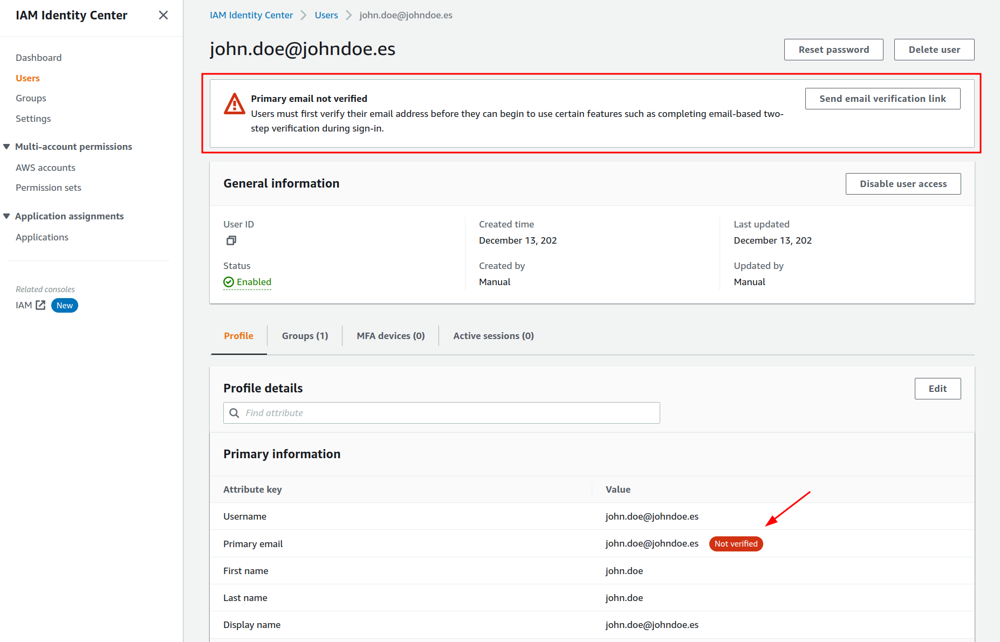
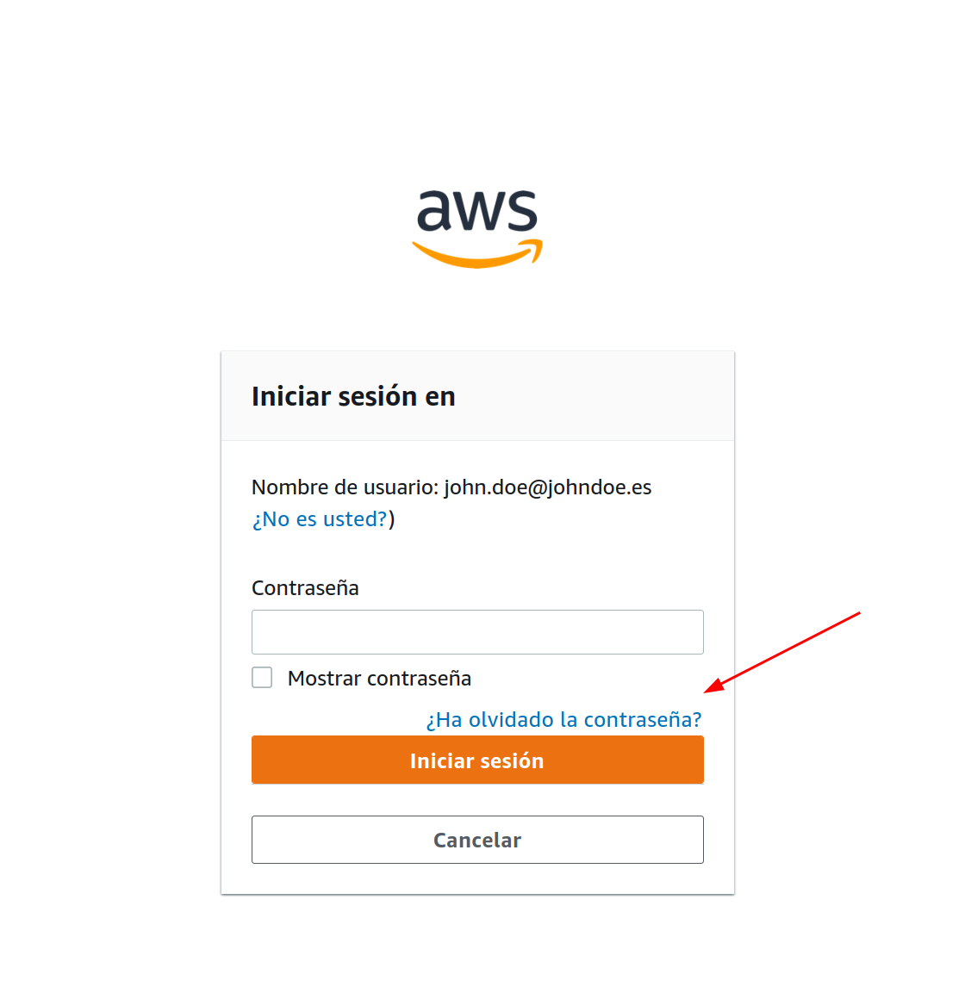

# SSO

**Index**

- [SSO](#sso)
  - [What is SSO?](#what-is-sso)
  - [User's Guide](#users-guide)
  - [Security obligations](#security-obligations)
  - [Recommendations on user migration from IAM](#recommendations-on-user-migration-from-iam)
  - [SSO Terraform](#sso-terraform)
    - [Users](#users)
    - [Groups](#groups)
    - [`users>group` attachments](#usersgroup-attachments)
    - [Policies](#policies)
      - [Customized policies](#customized-policies)
      - [Managed policies](#managed-policies)
      - [Inline policies](#inline-policies)
      - [Example of combined policies:](#example-of-combined-policies)
    - [Example of a complete document](#example-of-a-complete-document)
  - [Workflow](#workflow)
    - [Operate on the main repository](#operate-on-the-main-repository)
    - [If a new user has been created in the process](#if-a-new-user-has-been-created-in-the-process)
  - [If the group needs access to k8s (EKS)](#if-the-group-needs-access-to-k8s-eks)
  - [New User Guidance](#new-user-guidance)
  - [AWS console access](#aws-console-access)
  - [Programmatic access](#programmatic-access)

<br>

---

<br>

## What is SSO?

> [https://aws.amazon.com/es/single-sign-on/](https://aws.amazon.com/es/single-sign-on/)

Single sign-on (SSO) is an authentication solution that allows users to log in to multiple applications and websites with a single user authentication. As users today frequently access applications directly from their browsers, organizations prioritize access management strategies that improve both security and user experience. SSO provides both, as users can access all password-protected resources without a repeat login once their identity has been validated.

<br>

---

<br>

## User's Guide

> [https://docs.aws.amazon.com/singlesignon/latest/userguide/what-is.html](https://docs.aws.amazon.com/singlesignon/latest/userguide/what-is.html)

The SSO process is as follows:

  1. When a user logs into an application, the application generates an SSO token and sends an authentication request to the SSO service. 
  2. The service checks if the user was previously authenticated in the system. If so, it sends a confirmed authentication response to the application to grant access to the user. 
  3. If the user does not have a validated credential, the SSO service redirects the user to a central login system and prompts the user to submit his or her username and password.
  4. After submission, the service validates the user's credentials and sends the positive response to the application. 
  5. Otherwise, the user receives an error message and must re-enter the credentials. Multiple failed login attempts may result in the service blocking the user from further attempts for a fixed period of time.

<br>

---

<br>

## Security obligations

> [https://docs.aws.amazon.com/singlesignon/latest/userguide/security.html](https://docs.aws.amazon.com/singlesignon/latest/userguide/security.html)

  1. Only the owner of the organization (product, CTO, CEO...) should have the AWS root account.
  2. Keep users updated in their account. Do not leave inactive users enabled.
  3. Do not allow access to the AWS account through the root account.
  4. Be very careful with administrator permissions.
  5. Do not allow any user to embed credentials in code.
  6. Do not allow any user to lack MFA.
  7. Validate that IAM policies are not too permissive.
  8. Do not overlook any threat warnings that are presented to you.
  9. Rotate account passwords systematically and periodically.
  10. Force users to change their passwords as frequently.

<br>

---

<br>

## Recommendations on user migration from IAM

1. Write down in a list which users are to be migrated and which users are not to be migrated.
2. The users that will not be migrated must be disabled from the AWS organization by inactivating their access. Subsequently, once they have waited a reasonable time and confirmed that they have been migrated properly, they can be deleted.
3. Before disabling users, verify that they do not have any associated resources.
4. Standardize the user names, to improve readability and avoid duplicity problems.
5. Make sure that the users to be migrated have a valid e-mail address.
6. Organize users into groups, to make it easier to manage permissions.
7. Check if the users have administrator permissions, and if so, remove them.
8. Review the permissions of the associates, and if necessary, remove or restrict them.
9. Gradually migrate users, so that there are no availability problems.
10. Never start migrating users without being sure that the permissions are properly configured.

<br>

---

<br>

## SSO Terraform

The main document where [users](#users), [groups](#groups), [user/group association](#user) and [policies](#policies) should be entered is in sso.yaml.

### Users

Users must be in `users` with the following structure:

```yaml
users:
  - name: "userA"
    email: "test@test.test"
    fullname: "userA"
  - name: "userB"
    email: "test-2@test.test"
    fullname: "userB"
```

### Groups

The groups must be in `groups` with the following structure:

```yaml
  - name: "operadores-admin"
    description: "The operadores-admin group"
    users:
      - userA
      - userB
```

### `users>group` attachments 

Los usuarios y grupos se deben asociar mediante `attachments` con la siguiente estructura:

```yaml
attachments:
  "123456789012":
    permission-set-foo:
      groups:
        - groupA
      users:
        - userA
```

### Policies

Policies can be added in 3 different ways:

- [Customized policies](#customized-policies).
- [Managed policies](#managed-policies).
- [Inline policies](#inline-policies).

#### Customized policies
  - Policies (unmanaged).
  - They can be created in advance using terraform.
  - Only the policy name needs to be added.
  - It is not necessary to add the arn.
  - Are defined in `custom-policies` with the following structure:

```yaml
permission-sets:
  - name: "permission-set-foo"
    custom-policies:
      - name: "custom-policy-foo"
```

#### Managed policies

  - The arn of the policy must be added.
  - Are defined in `managed-policies` with the following structure:

```yaml
permission-sets:
  - name: "permission-set-foo"
    managed-policies:
      - "arn:aws:iam::aws:policy/AmazonS3FullAccess"
      - "arn:aws:iam::aws:policy/AmazonEC2FullAccess"
```

#### Inline policies

Policies created in the same yaml document. ⚠️ NOT RECOMMENDED. Its use is for testing.
  - It is necessary to add the policy name.
  - It is necessary to add the content of the policy.
  - The content of the policy must be in json format and must be indented with 2 spaces.
  - Are defined in `inline-policies` with the following structure:

```yaml
permission-sets:
  - name: "permission-set-foo"
    inline-policies:
      - name: "inline-policy-foo"
        policy: |
          {
            "Version": "2012-10-17",
            "Statement": [
              {
                "Effect": "Allow",
                "Action": [
                  "ec2:Describe*"
                ],
                "Resource": "*"
              }
            ]
          }
```

#### Example of combined policies:

```yaml
permission-sets:
  - name: "permission-set-foo"
    custom-policies:
      - name: "custom-policy-foo"
    managed-policies:
      - "arn:aws:iam::aws:policy/AmazonS3FullAccess"
      - "arn:aws:iam::aws:policy/AmazonEC2FullAccess"
    inline-policies:
      - name: "inline-policy-foo"
        policy: |
          {
            "Version": "2012-10-17",
            "Statement": [
              {
                "Effect": "Allow",
                "Action": [
                  "ec2:Describe*"
                ],
                "Resource": "*"
              }
            ]
          }
```

### Example of a complete document

```yaml
groups:
  - name: "groupA"
    description: "The Group A"
    users:
      - userA
      - userB

users:
  - name: "userA"
    email: "test@test.test"
    fullname: "userA"
  - name: "userB"
    email: "test-2@test.test"
    fullname: "userB"

permission-sets:
  - name: "permission-set-foo"
    custom-policies:
      - name: "custom-policy-foo"
    managed-policies:
      - "arn:aws:iam::aws:policy/AmazonS3FullAccess"
      - "arn:aws:iam::aws:policy/AmazonEC2FullAccess"
    inline-policies:
      - name: "inline-policy-foo"
        policy: |
          {
            "Version": "2012-10-17",
            "Statement": [
              {
                "Effect": "Allow",
                "Action": [
                  "ec2:Describe*"
                ],
                "Resource": "*"
              }
            ]
          }

attachments:
  123456789101:
    permission-set-foo:
      groups:
        - groupA
      users:
        - userA
```

<br>

---

<br>

## Workflow

### Operate on the main repository

1. Modify the `sso.yaml` file with the changes you want.
2. Generate a PR with the changes.
3. Verify that the verification pipeline is completed correctly.
4. Verify in the `terraform plan` step that the changes to be applied are as desired.
5. Wait for the approval of the PR by the repository owner.
6. Once the PR is approved, merge the PR.
7. Validate that the `terraform apply` pipeline is completed correctly.
8. Verify with the people involved that the changes have been applied correctly.

### If a new user has been created in the process

1. Access the user from the AWS console at IAM Identity Center (successor to AWS Single Sign-On)>Users.
<p align="center"></p>

2. Send the verification email.
<p align="center"></p>
<p align="center"></p>

## If the group needs access to k8s (EKS)

This step is necessary for the user to be able to access the k8s cluster with K9s or kubectl. Therefore, segregate users into groups that need or do not need access to k8s.

For example, if you create a role with permissions to access the k8s cluster, the user belonging to that group will have access to the k8s cluster.

> Note: a user can belong to several groups. Check the permissions assigned to each group carefully.

1. Locate the role-arn group using the group name. For example, if the group is named `front`, run the following command:

> Note: Replace `front` with the name of the group you created in the previous step.

```bash
ROLE_NAME="front"; aws iam list-roles --output text | grep $ROLE_NAME | grep -v Arn | cut -d '/' -f 5 | awk '{str="arn:aws:iam::123456789012:role/"; print str $1}'
```

```output
arn:aws:iam::123456789012:role/AWSReservedSSO_front_aa123456789012
```

1. Access the `default.tfvars` file in the `terraform/eks-next` directory of this same repository.
2. In the key `aws_auth_roles` add the role you have obtained in the previous step. For example:

```yaml
aws_auth_roles = [
  ...
  },
  {
    userarn  = "arn:aws:iam::1234567890123:role/AWSReservedSSO_front_aa94d123456789"
    username = "terraform"
    groups   = ["system:masters"]
  }
]
```

1. Pay attention to which group/s the role belongs to (users attached). There are several roles that you can consult in the RBAC directory of this same repository.
2. If you want it to have access to the whole cluster, add the role to the `system:masters` group (as in the previous example). If you want it to have access to a specific namespace.
3. Apply the changes with `terraform apply --var-file=default.tfvars` in the `terraform/eks-next` directory of this same repository.

## New User Guidance

1. Ask him to validate your account using the email you have received.
<p align="center"></p>

2. Provide the access link to the AWS console.

`https://nameexample.awsapps.com/start`

3. Ask him to log in to the AWS console, enter his user (email) and click `Forgot password?`
<p align="center">
  
  
</p>

4. The user will receive an email with a link to reset the password.
<p align="center"></p>

5. The user accesses the link and sets his password.

<br>

---

<br>

## AWS console access

The user accesses the AWS console with his user name and password. He will be able to access the services assigned to him from the AWS console (1).

<p align="center"></p>

<br>

---

<br>

## Programmatic access

1. The user can access AWS services programmatically. To do so, you must configure your AWS client with the credentials provided by AWS SSO (2).
2. Or, the user can configure your AWS client with the `nameexample-sso` profile provided by AWS SSO.

```bash
$ aws configure sso
SSO start URL [None]: https://nameexample.awsapps.com/start
SSO Region [None]: eu-west-1
SSO account id [None]: 123456789012
CLI default client Region [None]: eu-west-1
CLI default output format [None]: json
CLI profile name [None]: nameexample-sso
```

3. Once the profile is configured, you can access AWS services programmatically with the following command:

```bash
$ aws sso login --profile nameexample-sso
```

4. Copy the code and open the link in a browser window to authenticate with your AWS SSO username and password.

<p align="center"></p>
